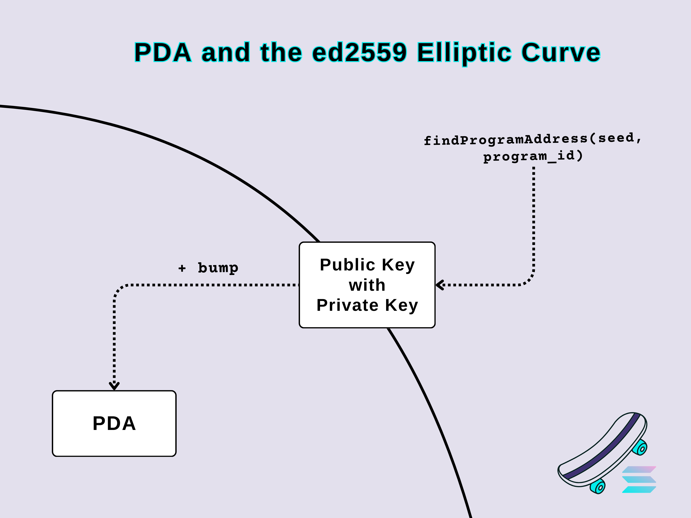

# 🛹 Program Derived Addresses


<br>

### tl; dr

<br>

* PDAs can be thought a way of mimic-ing web2's databases writing schemmes. For instance, a dApp that needs to update its own data without having a 'client' authorizing those changes.

* PDAs are addresses with special properties. They are not public keys (so they don't have an associated public key).

* * PDAs provide a mechanism to build hashmap-like structures on-chain, allowing programs to sign instructions.
    * `findProgramAddress` will deterministically derive a PDA from a `program_id`` and seeds (collection of bytes)
    * A bump (one byte) is used to push a potential PDA off the ed25519 elliptic curve.
    * Programs can sign for their PDAs by providing the seeds and bump to invoke_signed.

* PDAs simplify the programming model and make programs more secure. 


<br>

----

### Generating PDA

<br>

#### *When you use seeds to derive a public key, there is a chance that the seed you use and the public derived from them have an associated private key (depicted by the ed2559 elliptic curve).*
#### *So if the seeds derive a private key that exists in the curve, Solana will add an additional integer (a bump) to the seed list to make sure it bumps off the curve and cannot have a private key.*

<br>

<p align="center">

</p>


<br>

* PDA are created by hashing a number of seeds the user can choose with the `program_id`.

* Seeds can be anything: pubkey, strings, an array of numbers, etc.

* There is a 50% chance that this hash can result in a public key. This is how a bump can be searched:

<br>


```rust
fn find_pda(seeds, program_id) {
  for bump in 0..256 {
    let potential_pda = hash(seeds, bump, program_id);
    if is_pubkey(potential_pda) {
      continue;
    }
    return (potential_pda, bump);
  }
  panic!("Could not find pda after 256 tries.");
}
```

<br>

* The first bump that results in a PDA is called a "canonical bump," and they are the recommended one for usage.

<br>

----

### Interacting with PDAS

<br>

* When a PDA is generated, `findProgramAddress` returns both the address and the bump used to kick the address off the elliptic curve.

* With a bump, a program can sign any instruction that requires its PDA, by passing the instruction, the list of accounts, and the seeds and bumps used to derive the PDA to `invoke_signed`.

<br>

---

### Hashmap-like Structures with PDAs

<br>

* PDAs are hashed from a bump, a `program_id`, and several seeds. These seeds can be used to build hashmap-like structures on-chain.

* With PDA, you can create structs that encode the information about a relationship between the user and some data account, so that PDA serves as the address:

<br>

```rust
pub struct UserStats {
  level: u16,
  name: String,
  bump: u8
}
```

<br>


----

### CPI Signing with PDAs

<br>


* In some cases, it's possible to reduce the number of accounts needed by making a PDA storing state also sign a CPI instead of defining a separate PDA for that.

* This means that programs can be given control over assets, which they then manage according to the rules defined in the code.

<br>

----

### Examples of PDAs

<br>

* A program with global state:

```javascript
const [pda, bump] = await findProgramAddress(Buffer.from("GLOBAL_STATE"), programId)
```

<br>

* A program with user-specific data:

```javascript
const [pda, bump] = await web3.PublicKey.findProgramAddress(
  [
    publicKey.toBuffer()
  ],
  programId
)
```

<br>

* A program with multiple data items per user:

```javascript
const [pda, bump] = await web3.PublicKey.findProgramAddress(
  [
    publicKey.toBuffer(), 
    Buffer.from("Shopping list")
  ],
  programId,
);
```


<br>

---

### Demos

<br>

* Learn how PDA works on Anchor through [backend's demo 3](https://github.com/urani-labs/solana-dev-onboarding-rs/tree/main/demos/backend/03_anchor_pda).

* Learn how PDA and CPI work on Anchor through [backend's demo 4](https://github.com/urani-labs/solana-dev-onboarding-rs/tree/main/demos/backend/04_pda_and_cpi).

* Build a frontend dApp that leverages PDA through [frontend's demo 5](https://github.com/urani-labs/solana-dev-onboarding-rs/tree/main/demos/frontend/05_serialize_custom_data) and 
[frontend's demo 6](https://github.com/urani-labs/solana-dev-onboarding-rs/tree/main/demos/frontend/06_serialize_custom_data_II).


<br>


---

### References

<br>

* [Anchor Docs on PDA](https://www.anchor-lang.com/docs/pdas)
* [Solana's Cookbook on PDA](https://solanacookbook.com/core-concepts/pdas.html#facts)
* [Understanding PDAs, by brianfriel](https://www.brianfriel.xyz/understanding-program-derived-addresses/)
* [PDA, by Solana Bytes](https://www.youtube.com/watch?v=ZwFNPvqUclM&list=PLilwLeBwGuK51Ji870apdb88dnBr1Xqhm&index=8)
* [solana-program-library/token
/transfer-hook](https://github.com/igneous-labs/solana-program-library/tree/master/token/transfer-hook)

